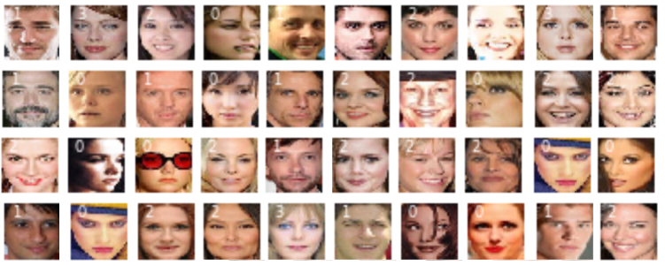
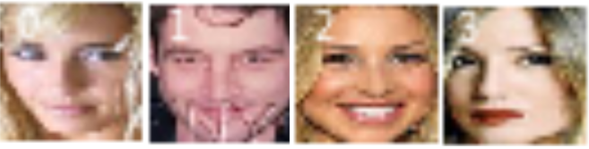
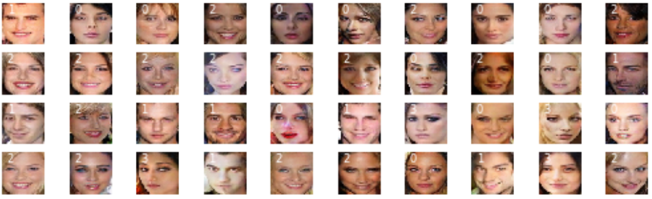
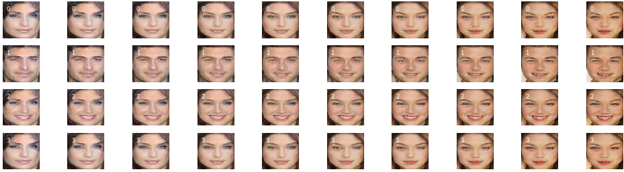

## cGANs with embedding in images - housekeeping
### Housekeeping python code for training and utilizing cGans with embedding.  

In particular I thank Jason Brownlee for his brilliant work and tutorials at https://machinelearningmastery.com (citations below in project), Iván de Paz Centeno for his work on face detection at https://github.com/ipazc/mtcnn, and  Jeff Heaton for his insights on embedding at https://www.youtube.com/user/HeatonResearch.  I found their code work to be complete, except for system related issues they ran 'out of the box' and they do a wonderful job of explaining why their streams work.  This should be considered a branch of Jason Brownlee's work on "vector arithmetic with faces".  

### Motivation for housekeeping:
Major issues with GANs include mode collapse and unscheduled interruptions of long running programs.  Even the best GAN program can leave a person scratching their head wondering why their "minor" changes result in various forms of mode collapse.  In particular, the user might discover there are no obvious solutions to bad initial randomized values, no obvious way to start a stream from where it left off, no apparent explanation for generated images which are fuzzy and obscure, warning messages that suddenly show up and cannot be turned off, and no obvious ways to vectorize generated images when embedding is employed.   
<p align="center">

</p>
In particular, the user may not have enough memory to use the code 'out of the box', it may take 20 or 30 attempts before it avoids mode collapse, attempts to debug Tensorflow or Keras may be hindered by never ending warning messages, matching dimensions of generator and discriminator models can be difficult, the stream may be unable to start from where it left off, the suggested learning rates may not be appropriate given small modifications, the user may run into issues with dated, or system specific code... there are so many obstacles that get in the way of operationalizing what ought to be a straight forward process.
</p>

As such, while good tutorials make coding as bare bones as possible so that it's easy to explain and understand the concepts being taught, the code delivered here goes in a different direction.  The Python programs included here invest a greater amount of coding in housekeeping so that they're, hopefully, able to carry on in spite of small obstacles.    

### Citations:
<dl>
<dt> Jason Brownlee, How to Develop a Conditional GAN (cGAN) From Scratch,</dt><dd> Available from https://machinelearningmastery.com/how-to-develop-a-conditional-generative-adversarial-network-from-scratch, accessed January 4th, 2020. </dd>
<dt>Jason Brownlee, How to Explore the GAN Latent Space When Generating Faces, </dt><dd>Available from https://machinelearningmastery.com/how-to-interpolate-and-perform-vector-arithmetic-with-faces-using-a-generative-adversarial-network, accessed January 13th, 2020. </dd>
<dt>Iván de Paz Centeno, MTCNN face detection implementation for TensorFlow, as a PIP package,</dt><dd> Available from https://github.com/ipazc/mtcnn, accessed February, 2020. </dd>
<dt>Jeff Heaton, Jeff Heaton's Deep Learning Course,</dt><dd> Available from https://www.heatonresearch.com/course/, accessed February, 2020. </dd>
</dl>

### Deliverables:
  1.  description of issues identified and resolved within specified limitations
  2.  code fragments illustrating the core of how the issue was resolved
  3.  Python programs to prepare images for selection and training
  4.  a cGan Python program with embedding
  5.  a Python program which vectorizes image generated with embedding

### Limitations and caveates:

  1.  stream:  refers to the overall process of streaming/moving data through input, algorithms, and output of data and its evaluation.
  2.  convergence:  since there are no unique solutions in GAN, convergence is sufficient when there are no apparent improvements in a subjective evaluation of clarity of images being generated.   
  3.  limited applicability:  the methods described work for a limited set of data and cGan problems.
  4.  bounds of model loss:  there is an apparent relationship between mode collapse and model loss - when model loss is extreme (too high or too low) then there is mode collapse.  
  
### Software and hardware requirements:
    - Python
        - Numpy
        - Tensorflow with Keras
        - Matplotlib
    - GPU is highly recommended
    - Operating system used for development and testing:  Windows 10

#### The process:

 Using a cGAN as illustration, I provide limited working solutions to the following problems:

<ol type="1">
  <li>is there an automatic way to recover before "mode collapse"?</li>
  <li>is there a way to restart a cGAN which is interrupted or has not completed convergence?</li>
  <li>are there non-random initialization values that can be useful?</li>
  <li>how important is the source material (original images of faces)?</li>
  <li>how can I use embedding when I have descriptions of images?</li>
  <li>how can I vectorize from generated face to generated face when using embedding?</li>
  <li>what other adjustments might be applied?</li>
<ol type="a">
	<li>selecting only faces with certain features (e.g. attractiveness)</li>
        <li>adjusting for memory requirements</li>
        <li>changing optimization from Adam to Adamax for embedding</li>
        <li>shutting off Tensorflow warning messages</li>
        <li>adding label to images</li>
</ol>
  <li>cGan stream:
<ol type="a">        
	<li>download celebrity images from https://www.kaggle.com/jessicali9530/celeba-dataset</li>
        <li>create face shots from images using https://github.com/ipazc/mtcnn</li>
        <li>select out subset of images with attractive faces</li>
        <li>cGan stream</li>
        <li>vectorize images</li>
</ol>
</ol>

### 1.  is there an automatic way to recover from some "mode collapse"?:
Even with reasonable learning rates, convergence can slide into "mode collapse" and require a manual restart.  The stream provides one way of giving intial estimates multiple but limited opportunities to halt it's slide towards mode collapse.  The process also allows the stream to retain whatever progress it has made towards convergence.  The screen shot below illustrates 1. recovery from "mode collapse", 2. the estimate of real and fake "accuracy", and 3. generated images from the first epoch.   

Before examining the screen shot which comes below, the measures used to determine when a recovery is necessary follow:
<table style="width:100%">
  <tr> <th> Column </th>    <th> measure </th>      <th> example </th>  </tr>
  <tr> <td> 1 </td>  <td> epoch/max_epochs </td>    <td> 1/100 </td>  </tr>
  <tr> <td> 2 </td>  <td> iteration/max_iterations  </td>    <td> 125/781 </td>  </tr>
  <tr> <td> 3 </td>  <td> discriminator loss </td>    <td> d1=0.020 </td>  </tr>
  <tr> <td> 4 </td>  <td> generator loss </td>    <td> d2=0.114 </td>  </tr>
  <tr> <td> 5 </td>  <td> gan loss </td>    <td> g=2.368 </td>  </tr>
  <tr> <td> 6 </td>  <td> run time (seconds) </td>   <td> secs=142 </td>  </tr>
  <tr> <td> 7 </td>  <td> number of restarts </td>    <td> tryAgain=0 </td>  </tr>
  <tr> <td> 8 </td>  <td> number of restarts using same base </td>    <td> nTripsOnSameSavedWts=0 </td>  </tr>
  <tr> <td> 9 </td>  <td> number of weight saves </td>    <td> nSaves=2 </td>  </tr>
</table>

<p align="center">

</p>

In section 1, we can see at epoch 1/100 and iteration 126/781, the discriminator loss has dropped to near zero and the gan loss is beginning to escalate.  Left to itself, the discriminator loss would drop to zero and the gan loss would escalate to a very high number (mode collapse).  In this case, the saved discriminator weights (d_weights) are loaded back in and the stream recovers.  

In section 2, we see proof of recovery at the end of epoch 1 with discriminator loss at 0.459 and gan loss at 1.280.  At this point, the accuracy for "real" is 77% and fake is 93%.  These values many not sound impessive until we look at the generated faces from epoch 1.

In section 3, we see a screen shot of the generated faces from epoch 1 out of 100 epoches.  

So how can we recover from a mode collapse.  The syntax below illustrates the core of the process:  

```Python
		if (d_loss1 < 0.001 or d_loss1 > 2.0) and ijSave > 0:
			print("RELOADING d_model weights",j+1," from ",ijSave)
			d_model.set_weights(d_trainable_weights)
		if (d_loss2 < 0.001 or d_loss2 > 2.0) and ijSave > 0:
			print("RELOADING g_model weights",j+1," from ",ijSave)
			g_model.set_weights(g_trainable_weights)
		if (g_loss < 0.010 or g_loss > 4.50) and ijSave > 0:
			print("RELOADING gan_models weights",j+1," from ",ijSave)
			gan_model.set_weights(gan_trainable_weights)
```
The previous programming fragment illustrates an approach which often prevents a stream from mode collapse.  It depends on having captured disciminator weights, generator weights, and gan weights either during initialization or later in the process when all model losses are within bounds.  The definition of model loss bounds are arbitrary but reflect expert opinion about when losses are what might be expected and when they are clearly much too high or much too low.  Reasonable discriminator and generator losses are between 0.1 and 1.0, and their arbitrary bounds are set to between 0.001 and 2.0.  Reasonable gan losses are between 0.2 and 2.0 and their arbitrary bounds are set to 0.01 and 4.5.  

What happens then is discriminator, generator, and gan weights are collected when all three losses are "reasonable".  When an individual model's loss goes out of bounds, then the last collected weights for that particular model (and only that model) are replaced, leaving the other model weights are they are, and the process moves forward.  The process stops when mode collapse appears to be unavoidable even when model weights are replaced.  This is identified when a particular set of model weights continue to be reused but repeatedly result in out of bound model losses.   

The programming fragment for saving the weights are:

```Python
	if d_loss1 > 0.30 and d_loss1 < 0.95 and d_loss2 > 0.25 and d_loss2 < 0.95 and g_loss > 0.40 and g_loss < 1.50:
		d_trainable_weights = np.array(d_model.get_weights())
		g_trainable_weights = np.array(g_model.get_weights())
		gan_trainable_weights = np.array(gan_model.get_weights())
```
Needless to say, there are a few additional requirements which can be found in the stream available at the end of the project.  For instance, if your stream goes into mode collapse just after saving your trainable weights, you don't want to reuse the most recently saved weights.  

### 2.  is there a way to restart a cGAN which has not completed convergence:
There is nothing quite as upsetting as running a stream and six days later the process is interrupted when it appears to be 90% complete.  Like many others, I have run streams for over 21 days using my GPU before something goes wrong and I am unable to restart the process.  Progress is measured in "epochs".  There is no guarantee but with a bit of good fortune and cGAN steams which are properly set up, every epoch brings an improvement in clarity.  The images which follow illustrate easily observed improvements over epochs.  
<p align="center">

</p>
  
The numbers on the left side are epochs required to produce the observed results.  We can see the faint images of faces by epoch 5, good impressions of faces by epoch 45, details of faces by epoch 165 and small improvements by epoch 205.  We want to do better than being stuck at epoch 45 and we want to be able to continue from epoch 45 if the process is interrupted.  We are, in a sense, mapping from a 100-dimensional space to images of faces - it takes time to complete the mapping from representative parts of the 100-dimensional space.      
    
Needless to say, the steam needs to be prepared for interruptions.  Even with preparation, attempts to restart can result in warnings about model and/or layers being trainable=False, dimensions of weights being different for discriminate, generative, and gan models, and optimizations that collapse.  It's important to note that cGAN will not properly restart unless you resolve the issues of what is trainable, what are the correct dimensions, and what are viable models. If your only interest is in examining weights and optimization, then warning messages can often be ignored.  If you wish to restart from where you left off, then you ignore warning messages at considerable risk.   
 
Once issues with dimensions and what is trainable are resolved, there are then problems where models suffer from model collapse when attempts are made to restart the cGAN.  What happened?  If you wish to continue executing the stream you need to handle the GAN model as a new instance using the loaded discriminator and generator models.  After all, the GAN model is there only to constrain the make the discriminator and generator work together.  
 
Restarting a cGAN requires saving models and their optimizations in case they are required after each epoch.  When saving a model, the layers that get saved are those which are trainable.  It's worth recalling that the discriminator model is set to trainable=False within the gan model.  Depending on the requirements, there may also be layers which are set to trainable=False.  In order to save the models, and recover the fixed weights, the weights must temporarily be set to trainable=True.  The following code fragment is required when saving the discriminator model:  
```Python
	filename = 'celeb/results/generator_model_dis%03d.h5' % (epoch+1)
	d_model.trainable = True
	for layer in d_model.layers:
		layer.trainable = True
	d_model.save(filename)
	d_model.trainable = False
	for layer in d_model.layers:
		layer.trainable = False
```
And when loading:
```Python
	filename = 'celeb/results/generator_model_dis%03d.h5' % (ist_epochs)
	d_model = load_model(filename, compile=True)
	d_model.trainable = True
	for layer in d_model.layers:
		layer.trainable = True
	d_model.summary()
```
Setting the layers on an individual basis may seem overly detailed but it is a reminder that, in some circumstances, there are layers which need to be set to trainable-False.     

### 3.  are there non-random initialization values that can be useful?
While the use of normal like distributions may be useful, there is no reason to believe that other distributions will not work.  A small investigation on my part suggested that leptokurtic distributions were poorest in generating good images.  For most of the results discussed here, I use a bounded 100-dimensional space and there is no reason that I am aware of for fine tuning centroid values as opposed to values at the upper and lower extremes.   
```Python
def generate_latent_points(latent_dim, n_samples, cumProbs, n_classes=4):
	# print("generate_latent_points: ", latent_dim, n_samples)
	initX = -3.0
	rangeX = 2.0*abs(initX)
	stepX = rangeX / (latent_dim * n_samples)
	x_input = asarray([initX + stepX*(float(i)) for i in range(0,latent_dim * n_samples)])
	shuffle(x_input)
	# reshape into a batch of inputs for the network
	z_input = x_input.reshape(n_samples, latent_dim)
	randx = random(n_samples)
	labels = np.zeros(n_samples, dtype=int)
	for i in range(n_classes):
		labels = np.where((randx >= cumProbs[i]) & (randx < cumProbs[i+1]), i, labels)
	return [z_input, labels]
```
Substantially, the routine divides the range of values from -3.0 to +3.0 into equal intervals and then randomizes the values by a shuffle.  
 
### 4.  how important is the source material (original images of faces)?
In my attempts to improve the results of the generations, I managed to overlook a critical factor - what does the data going into the cGAN look like.  When the data going into a stream is a derivative of another process, as in this case, it is critical to examine the quality of the input data before declaring the results to be useful or invalid.  

The code to examine the data going into the cGAN is trivial and is included in the final stream but the faces are worth examining.  



When we look at the transformed images going into the analysis in detail, we can see effects due to pixelation.  


### 5.  how can I use embedding when I have descriptions of images?
There are circumstances where we want to insure that a generated image has particular characteristics, such as a face being attractive, selecting a particular gender, and having facial features such as high cheek bones and large lips.  Looking into the near future, it will be possible to create realistic GAN generated images of models wearing fashionable clothing, with specific expressions, and poses for catalogues.  In this example, we could enter in the attributes:  attractive, female, high cheek bones, and large lips.  

There were three parts to this process:  
1. selecting a subset of faces (only those identified as being "attractive"):
Details of the process are discussed in section 7. 
2. identifying the characteristics or attributes to be used and their probabilities in the population of images:
      a. 0 = featured as being attractive and not male and not high cheek bone and not large lips
      b. 1 = featured as being attractive and male
      c. 2 = featured as being attractive and not male and high cheek bone
      d. 3 = featured as being attractive and not male and not high cheek bone and large lips 
3. setting up the cGAN so that it will generate and save faces based on the attributes (embeddings) associated with an image.  

There are four kinds of embedding and the identity of the embedding (0 thru 3) is included in the generated face. In many ways, those faces identified as being 0 are "female without high cheeck bones and without large lips".  Those faces identified as 1 (male), are clearly male.  Those faces identifed as 2 are female with high cheek bones.  Feature 3 identifies those faces which supposedly have large lips.  The labels (0 thru 3) are added when creating the image.  Explanations for what we found is discussed in section 6.  
### 6.  how can I vectorize from generated face to generated face when using embedding?
Jeff Brownlee provides a brilliant example of how to vectorize from one face to another face.  In addition to what Brownlee had done, we vectorize two generated faces and then, for the same 100-dimensional space, "add" the predictiver value of the features through embedding as described in section 5. 


Going from left to right, we see the face on the left morphing into the face on the right.  When we compare each row, we see the four features described in section 5.  The only difference between each row are due to the predictive power of the embeddings.  Of particular interest is comparing the second row (embedded value 1: attractive male) with the third row (embedded value 2: attractive female with high cheek bones). Everything except the embedding is identical.  

From an analytical perspective, comparing rows 3 and 4 (embedded value 2: attractive female with high cheek bones versus embedded value 3: attractive female with large lips) provides insight into what feature selection and embedding means.  While the persons identifying features may believe they are only looking at a feature, such as the size of lips, the analytical process of cGans actually identifies what is uniquely different in comparing rows three and four.  

### 7.  other changes that can be applied?

There are a number of other adjustments were made in order with the hope of improving results.  

#### a. only selecting faces with certain characteristics - such as attractiveness
 
Only faces identified as being attractive were included - it appeared to be a good way to select out those faces which were complete.  
```Python
	# enumerate files
	for idx, filename in enumerate(listdir(directory)):
		# load the image
		pixels = load_image(directory + filename)
		# get face
		face = extract_face(model, pixels)
		if face is None:
			continue
		if data_attractive[idx] == -1.0:
			continue
```
#### b. adjusting for memory requirements

One of the most frequent modifications novices have to face is adjusting batch sizes in order to fit the problem onto their GPU.  In this particular case, the fork required a change of n_batch from 128 to 64.    
```Python
def train(g_model, d_model, gan_model, dataset, latent_dim, n_epochs=100, n_batch=128, ist_epochs=0):
	bat_per_epo = int(dataset[0].shape[0] / n_batch)
...
train(g_model, d_model, gan_model,  dataset, latent_dim, n_epochs=n_epochs, n_batch=64, ist_epochs=ist_epochs)
```
#### c. changing optimization from Adam to Adamax for embedding

While Adam optimizers are generally the best option, GANs with embedding are best optimized with Adamax.  
```Python
	opt = Adamax(lr=0.00007, beta_1=0.08, beta_2=0.999, epsilon=10e-8)
```
#### d. shutting off Tensorflow warnings
One of the great aspects of Tensorflow is it is very good at giving warnings when syntax being used is out of date, dimensions do not match, or features (such as trainable=True) are not appropriate.  The problem is you sometimes have to run through many warnings before seeing the impact of the issue.  Being able to shut off useful warnings can be helpful.  
```Python
qErrorHide = True
if qErrorHide:
    print("\n***REMEMBER:  WARNINGS turned OFF***\n***REMEMBER:  WARNINGS turned OFF***\n")
    log().setLevel('ERROR')
```
#### e. adding label to the images 
In order to best evaluate results, it is helpful to have a label stamped on an image.  
```Python
def save_plot(examples, labels, epoch, n=10):
	examples = (examples + 1) / 2.0
	# plot images
	for i in range(n * n):
		fig = plt.subplot(n, n, 1 + i)
		strLabel = str(labels[i])
		fig.axis('off')
		fig.text(8.0,20.0,strLabel, fontsize=6, color='white')
		fig.imshow(examples[i])
	filename = 'celeb/results/generated_plot_e%03d.png' % (epoch+1)
	plt.savefig(filename)
	plt.close()
```
###  8.  cGan stream:
#### a. download celebrity images from https://www.kaggle.com/jessicali9530/celeba-dataset
#### b. create face shots from images using https://github.com/ipazc/mtcnn
#### c. select out subset of images with attractive faces and compress
<a href="/files/images_convert_mtcnn_attractive_faces.py">MTCNN convert attractive faces</a>
#### d. cGan stream 
<a href="/files/tutorial_latent_space_embedding_cgan.py">cGan embedding</a>
#### e. vectorize images
<a href="/files/images_run_thru_models_1_restart_cgan.py">run thru faces using embedding</a>

LICENSE  <a href="/LICENSE">MIT license</a>
