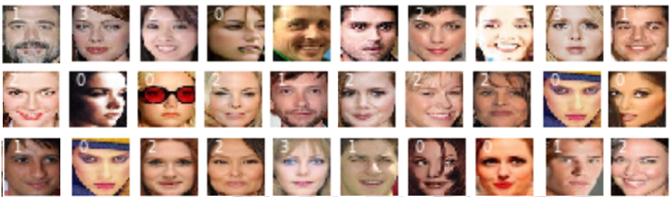

## cGANs_with_embedding in images - housekeeping
### Housekeeping python code for training and utilizing cGans with embedding.  

In particular I thank Jason Brownlee for his brilliant work and tutorials at https://machinelearningmastery.com (plain text citations follow), Jeff Heaton for his insights on embedding at https://www.youtube.com/user/HeatonResearch, and Iván de Paz Centeno for his work on face detection https://github.com/ipazc/mtcnn.  I found their code work to be complete, they run 'out of the box' and they do a wonderful job of explaining why their streams work.  The test of great tutorials is, of course, whether they motivate a person to venture beyond the safe haven of working code.  In my view, these tutorials delivered as promised in spades.  

#### Motivation for housekeeping:
Even the best tutorials can leave a person scratching their head wondering why their "minor" changes result in various forms of mode collapse.  In particular, the user might discover there are no obvious solutions to bad initial randomized values, no obvious way to start a stream from where it left off, no apparent explanation for generated images which are fuzzy and obscure, warning messages that suddenly show up and cannot be turned off, and no obvious ways to vectorize generated images when embedding is employed.   
<!--   -->
<p align="center">

</p>
In particular, the user may not have enough memory to use the code 'out of the box', it may take 20 or 30 attempts before it avoids mode collapse, attempts to debug Tensorflow or Keras are hindered by never ending warning messages, matching dimensions of generator and discriminator models can be difficult, the stream may be unable to start from where it left off, the suggested learning rates may not be appropriate given small modifications, the user may run into issues with dated, or system specific code... there are so many obstacles that get in the way of operationalizing what ought to be a trivial process.


As such, while good tutorials make coding as bare bones as possible so that it's easy to explain and understand the concepts being taught, the code delivered here goes in a different direction.  The Python programs included here invest a greater amount of coding in housekeeping so that they're able to carry on in spite of small obstacles.    

#### Citations:
    Jason Brownlee, How to Develop a Conditional GAN (cGAN) From Scratch, 
        Available from https://machinelearningmastery.com/how-to-develop-a-conditional-generative-adversarial-network-from-scratch, accessed January 4th, 2020.
    Jason Brownlee, How to Explore the GAN Latent Space When Generating Faces, 
        Available from https://machinelearningmastery.com/how-to-interpolate-and-perform-vector-arithmetic-with-faces-using-a-generative-adversarial-network, accessed January 13th, 2020.
    Jeff Heaton, Jeff Heaton's Deep Learning Course, 
        Available from https://www.heatonresearch.com/course/, accessed February, 2020.
    Iván de Paz Centeno, MTCNN face detection implementation for TensorFlow, as a PIP package, 
        Available from https://github.com/ipazc/mtcnn, accessed February, 2020.

#### Deliverables:
  1.  description of issues identified and resolved
  2.  code fragments illustrating the core of how the issue was resolved
  3.  a cGan Python program with embedding
  4.  vectorized image generation with embedding

#### Limitations:
There are a numbers of definitions and perspective which I use coming out of my background in analytics.  
  1.  stream:  the overall process of streaming/moving data through input, algorithms, and output of data and its evaluation.
  2.  convergence:  since there are no unique solutions in GAN, convergence is sufficient when there are no apparent improvements in a subjective evaluation of clarity of images being generated.   
  3.  limited applicability:  the methods described work for a limited set of data and cGan problems.
  4.  bounds of model loss:  there is an apparent relationship between mode collapse and model loss - when model loss is extreme (too high or too low) then there is mode collapse.  
  
#### Software and hardware requirements:
    - Python
        - Numpy
        - Tensorflow with Keras
        - Matplotlib
    - GPU is highly recommended
    - Operating system used for development and testing:  Windows 10

##### The process:

 Using a cGAN as illustration, I provide limited working solutions to the following problems:

  1.  is there an automatic way to recover before "mode collapse"?
  2.  is there a way to restart a cGAN which is interrupted or has not completed convergence?
  3.  are there non-random initialization values that can be useful?
  4.  how important is the source material (original images of faces)?
  5.  how can I use embedding when I have descriptions of images?
  6.  how can I vectorize from generated face to generated face when using embedding?
  7.  what other adjustments might be applied?
        - selecting only faces with certain features (e.g. attractiveness)
        - adjusting for memory requirements
        - changing optimization from Adam to Adamax for embedding
        - shutting off Tensorflow warning messages
        - adding label to images
  8.  cGan stream:
        - download celebrity images
        - create face shots from images
        - select out subset of images with attractive faces and compress
        - cGan stream 
        - vectorize images
  
### 1.  is there an automatic way to recover from some "mode collapse"?:
Even with reasonable learning rates, convergence can slide into "mode collapse" and require a manual restart.  The stream provides one way of giving intial estimates multiple but limited opportunities to halt it's slide towards mode collapse.  The process also allows the stream to retain whatever progress it has made towards convergence.  
```Python
		if (d_loss1 < 0.001 or d_loss1 > 2.0) and ijSave > 0:
			print("RELOADING d_model weights",j+1," from ",ijSave)
			d_model.set_weights(d_trainable_weights)
		if (d_loss2 < 0.001 or d_loss2 > 2.0) and ijSave > 0:
			print("RELOADING g_model weights",j+1," from ",ijSave)
			g_model.set_weights(g_trainable_weights)
		if (g_loss < 0.010 or g_loss > 4.50) and ijSave > 0:
			print("RELOADING gan_models weights",j+1," from ",ijSave)
			gan_model.set_weights(gan_trainable_weights)
```
It is apparent there is a relationship between model loss and mode collapse.  The previous programming fragment illustrates an approach which often prevents a stream from mode collapse.  It depends on having captured disciminator weights, generator weights, and gan weights either during initialization or later in the process when all model losses are within bounds.  The definition of model loss bounds are arbitrary but reflect expert opinion about when losses are what might be expected and when they are clearly much too high or much too low.  Reasonable discriminator and generator losses are between 0.1 and 1.0, and their arbitrary bounds are set to between 0.001 and 2.0.  Reasonable gan losses are between 0.2 and 2.0 and their arbitrary bounds are set to 0.01 and 4.5.  

What happens then is discriminator, generator, and gan weights are collected when all three losses are "reasonable".  When an individual model's loss goes out of bounds, then the last collected weights for that particular model (and only that model) are replaced, leaving the other model weights are they are, and the process moves forward.  The process stops when mode collapse appears to be unavoidable even when model weights are replaced.  This is identified when a particular set of model weights continue to be reused but repeatedly result in out of bound model losses.    

### 2.  is there a way to restart a cGAN which has not completed convergence:
There is nothing quite as upsetting as running a stream and six days later the process is interrupted when it appears to be 90% complete.  Needless to say, your steam needs to be prepared for such an event.  Even with preparation, attempts to restart can result in warnings about parameters being not trainable, dimensions of weights being wrong for discriminate, generative, and gan models, and optimizations that collapse.  There is a lot of helpful advice if you just want to inspect weights but after six days, you want to start where you left off - how do you do it?  It's important to note that cGAN will not properly restart unless you resolve the issues of what is trainable, what are the correct dimensions, and what are viable models.    
<p align="center">

</p>
Once issues with dimensions and what is trainable are resolved, there are then problems where models suffer from model collapse when attempts are made to restart the cGAN.  What happened?  If you wish to continue executing the stream, rather than simply inspect weights, you need to handle the GAN model as a new instance using the loaded discriminator and generator models.  After all, the GAN model is there only to make the discriminator and generator work together.  

Restarting a cGAN requires saving models and their optimizations in case they are required.  When saving a model, the layers that get saved are those which are trainable.  It's worth remembering that the discriminator model is set to trainable=False within the gan model.   Needless to say, there are places in a stream where layers or models need to be trainable=False.  The following code fragment is required when saving the discriminator model:  
```Python
	filename = 'celeb/results/generator_model_dis%03d.h5' % (epoch+1)
	d_model.trainable = True
	for layer in d_model.layers:
		layer.trainable = True
	d_model.save(filename)
	d_model.trainable = False
	for layer in d_model.layers:
		layer.trainable = False
```
And when loading:
```Python
	filename = 'celeb/results/generator_model_dis%03d.h5' % (ist_epochs)
	d_model = load_model(filename, compile=True)
	d_model.trainable = True
	for layer in d_model.layers:
		layer.trainable = True
	d_model.summary()
```
Matters are made slightly more complicated if I want to be able to make the embedding layers trainable=False once training is complete but add other images to the training.    

### 3.  are there non-random initialization values that can be useful?
I have found no reason to believe that normal like distributions of random values are better than uniform distributions of random values.  A small investigation on that issue indicated that leptokurtic distributions were poorest in generating good images.  In general statistical analysis using normal distributions, those values which are furthest away from the centroid provide the greatest amount of information.  Do we really believe this when generating images?  For most of the results discussed here, I use a bounded 100-dimensional space and there is no reason that I am aware of for fine tuning centroid values as opposed to values at the upper and lower extremes.   
```Python
def generate_latent_points(latent_dim, n_samples, cumProbs, n_classes=4):
	# print("generate_latent_points: ", latent_dim, n_samples)
	initX = -3.0
	rangeX = 2.0*abs(initX)
	stepX = rangeX / (latent_dim * n_samples)
	x_input = asarray([initX + stepX*(float(i)) for i in range(0,latent_dim * n_samples)])
	shuffle(x_input)
	# reshape into a batch of inputs for the network
	z_input = x_input.reshape(n_samples, latent_dim)
	randx = random(n_samples)
	labels = np.zeros(n_samples, dtype=int)
	for i in range(n_classes):
		labels = np.where((randx >= cumProbs[i]) & (randx < cumProbs[i+1]), i, labels)
	return [z_input, labels]
```
 
### 4.  how important is the source material (original images of faces)?
There is a well known acronym GIGO (garbage in, garbage out), and no one is surprised by words of advice to examine the data going into the stream.  When the data going into a stream is a derivative of another process, as in this case, it is important to examine the quality of the input data before declaring a process to be useful or invalid.  

It is easy to forget to examine the transformed data that goes into an analysis, no matter what the subject matter of the analysis is.



```Python
def save_real_plots(dataset, nRealPlots = 5, n=10, n_samples=100):
	# plot images
	for epoch in range(nRealPlots):
		if epoch%5==0:
			print("real_plots: ", epoch)
		# prepare real samples
		[X_real, labels], y_real = generate_real_samples(dataset, n_samples)
		# scale from [-1,1] to [0,1]
		X_real = (X_real + 1) / 2.0
		for i in range(n * n):
			# define subplot
			fig = plt.subplot(n, n, 1 + i)
			strLabel = str(labels[i])
			fig.axis('off')
			fig.text(8.0,20.0,strLabel, fontsize=6, color='white')
			# plot raw pixel data
			fig.imshow(X_real[i])
		# save plot to file
		filename = 'celeb/real_plots/real_plot_e%03d.png' % (epoch+1)
		plt.savefig(filename)
		plt.close()
```
When we look at the transformed images going into the analysis in detail, we can see effects due to pixelation.  


### 5.  how can I use embedding when I have descriptions of images?
There are circumstances where we want to insure that a generated image has particular characteristics, such as a face being attractive, male or female, having high cheek bones, large lips, and other features.  Looking into the near future, it will be possible to create realistic GAN generated images of models wearing fashionable clothing, with specific expressions, and poses for catalogues.  

There were three parts to this process:  
1. selecting a subset of faces (only those identified as being "attractive"):
Details of the process are discussed in section 7. 
2. identifying the characteristics or attributes to be used and their probabilities in the population of images:
      a. 0 = featured as being attractive and not male and not high cheek bone and not large lips
      b. 1 = featured as being attractive and male
      c. 2 = featured as being attractive and not male and high cheek bone
      d. 3 = featured as being attractive and not male and not high cheek bone and large lips 
3. setting up the cGAN so that it will generate and save faces based on the attributes (embeddings) associated with a image.  

As you can see, there are four kinds of embedding and the identity of the embedding (from 0 to 4) is included in the generated face. In many ways, those faces identified as being 0 are "featureless".  Those faces identified as 1 (male), are clearly male.  Those faces identifed as 2 are female with high cheek bones.  Feature 3 identifies those faces which supposedly have large lips.  To be clear, embedding does NOT refer to the cardinal number being included in the image - those labels are added when creating the image.  Explanations for what we found is discussed in section 6.  
### 6.  how can I vectorize from generated face to generated face when using embedding?
Jeff Brownlee provides what I believe is a brilliant example of how to vectorize from one face to another face.  In addition to what Brownlee had done, we vectorize two generated faces and then, for the same 100-dimensional space, "add" the predictiver value of the features through embedding as described in section 5. 


Going from left to right, we see the face on the left morphing into the face on the right.  When we compare each row, we see the four features described in section 5.  The only difference between each row are due to the predictive power of the embeddings.  Of particular interest is comparing the second row (embedded value 1: attractive male) with the third row (embedded value 2: attractive female with high cheek bones). It's important to note that everything except the embedding is identical.  

From an analytical perspective, comparing row 4 (embedded value 2: attractive female with high cheek bones versus embedded value 3: attractive female with large lips) provides insight into what feature selection and embedding means.  While the persons identifying features may believe they are looking only at size of lips, the analytical process of cGans identifies what is uniquely different in comparing rows three and four.  

### 7.  other changes that can be applied?
- only selecting faces with certain characteristics - such as attractiveness
 
```Python
	# enumerate files
	for idx, filename in enumerate(listdir(directory)):
		# load the image
		pixels = load_image(directory + filename)
		# get face
		face = extract_face(model, pixels)
		if face is None:
			continue
		if data_attractive[idx] == -1.0:
			continue
```
- adjusting for memory requirements
```Python
def train(g_model, d_model, gan_model, dataset, latent_dim, n_epochs=100, n_batch=128, ist_epochs=0):
	bat_per_epo = int(dataset[0].shape[0] / n_batch)
...
train(g_model, d_model, gan_model,  dataset, latent_dim, n_epochs=n_epochs, n_batch=64, ist_epochs=ist_epochs)
```
- changing optimization from Adam to Adamax for embedding
```Python
	opt = Adamax(lr=0.00007, beta_1=0.08, beta_2=0.999, epsilon=10e-8)
```
- shutting off Tensorflow warnings
```Python
qErrorHide = True
if qErrorHide:
    print("\n***REMEMBER:  WARNINGS turned OFF***\n***REMEMBER:  WARNINGS turned OFF***\n")
    log().setLevel('ERROR')
```
- adding label to the images 
```Python
def save_plot(examples, labels, epoch, n=10):
	examples = (examples + 1) / 2.0
	# plot images
	for i in range(n * n):
		fig = plt.subplot(n, n, 1 + i)
		strLabel = str(labels[i])
		fig.axis('off')
		fig.text(8.0,20.0,strLabel, fontsize=6, color='white')
		fig.imshow(examples[i])
	filename = 'celeb/results/generated_plot_e%03d.png' % (epoch+1)
	plt.savefig(filename)
	plt.close()
```
###  8.  cGan stream:
        - download celebrity images
        - create face shots from images
        - select out subset of images with attractive faces and compress
        - cGan stream 
        - vectorize images
